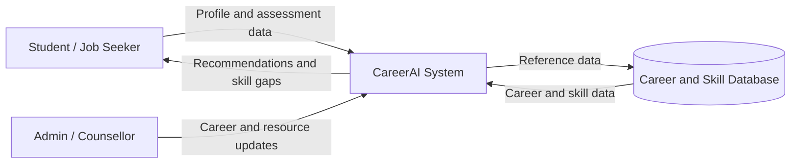
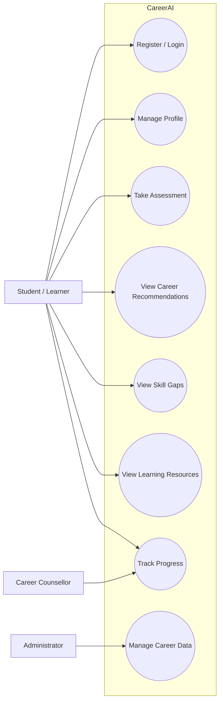
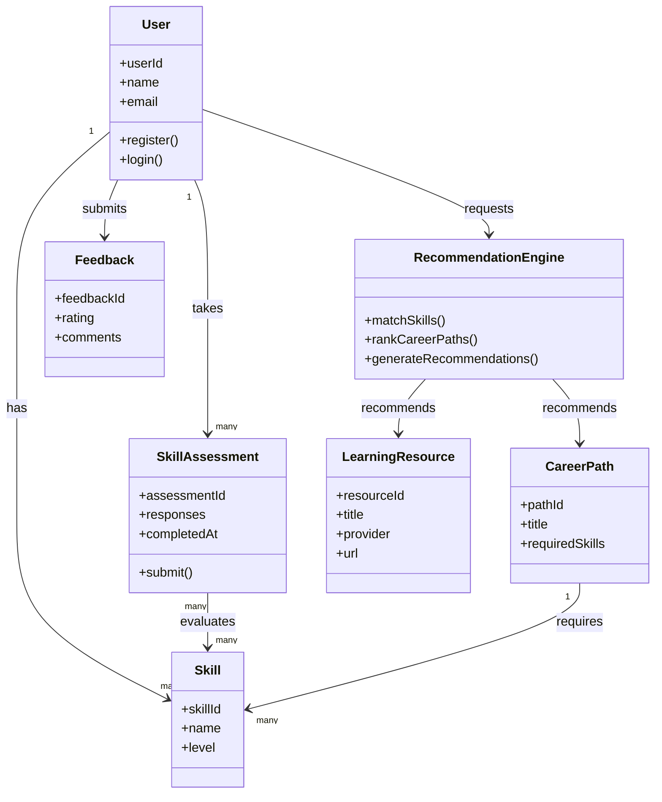
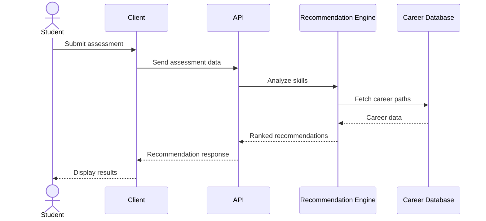
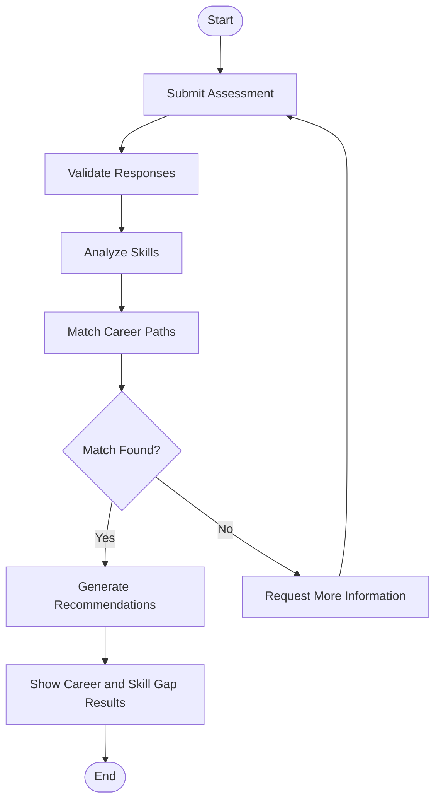
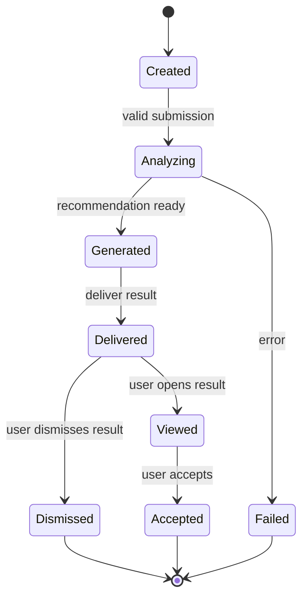
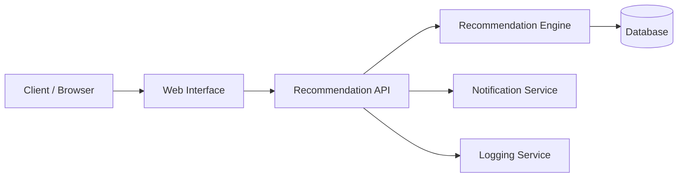
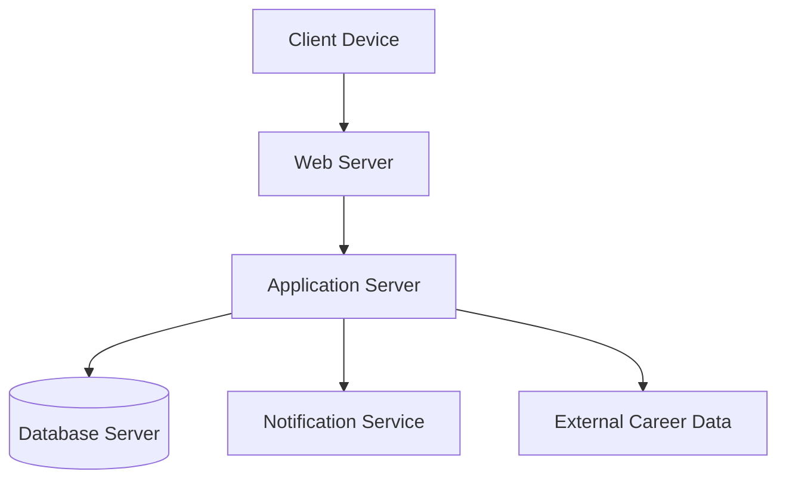

# CareerAI

## AI Career Guidance and Skill Recommendation System

CareerAI is a web-based intelligent system designed to help students and early-career professionals make informed career decisions. It analyzes academic background, interests, and existing skills to recommend suitable career paths, identify skill gaps, and suggest relevant learning resources.

## Key Features

- User registration and authentication
- Profile creation and management
- Skill and interest assessment
- AI-based career path recommendations
- Skill-gap analysis
- Learning resource recommendations
- Learning progress tracking
- Resume/profile skill import
- Career search and filtering
- Recommendation feedback
- Admin content management
- Notifications and reporting support

## Project Scope

The current project focuses on a responsive web application for students, fresh graduates, and early-career professionals. Direct job placement, corporate ATS/recruitment integration, real-time one-to-one video counselling, native mobile applications, and payment processing are outside the current release scope.

## Requirement Overview

### Functional Requirements

| ID | Requirement |
|---|---|
| FR-01 | User Registration & Authentication |
| FR-02 | Profile Creation |
| FR-03 | Career Path Recommendation |
| FR-04 | Skill Gap Analysis |
| FR-05 | Learning Resource Recommendation |
| FR-06 | Progress Tracking |
| FR-07 | Resume/Profile Skill Import |
| FR-08 | Search & Filter Careers |
| FR-09 | Feedback Submission |
| FR-10 | Admin Content Management |
| FR-11 | Notifications |
| FR-12 | Reporting Dashboard |

### Non-Functional Requirements

- **Performance:** Recommendations should be generated within the specified response time under normal conditions.
- **Usability:** The interface should be intuitive for first-time users.
- **Security:** Sensitive user information should be protected and encrypted.
- **Availability:** The system should remain available during normal use and evaluation.
- **Scalability:** The architecture should support future growth.
- **Compatibility:** The web application should work across major modern browsers and screen sizes.
- **Maintainability:** The system should use modular and documented components.
- **Reliability:** Invalid input and service failures should be handled gracefully.

# System Diagrams

## 1. DFD – Level 0

## 2. UML Use Case Diagram

## 3. UML Class Diagram

## 4. UML Sequence Diagram

## 5. UML Activity Diagram

## 6. UML State Machine Diagram

## 7. UML Component Diagram

## 8. UML Deployment Diagram

## Rule Table / Decision Table

The recommendation logic considers the user's skill level and interest match to decide the next action.

| Rule | Skill Level | Interest Match | System Action | Priority |
|---|---|---|---|---|
| R1 | High | Yes | Recommend strongly matched career path | Must Have |
| R2 | High | No | Suggest alternative career paths based on profile | Should Have |
| R3 | Low/Medium | Yes | Recommend career, identify skill gaps, and suggest learning resources | Must Have |
| R4 | Low/Medium | No | Request/refine assessment information before recommending | Should Have |

## Requirement Prioritization – MoSCoW

- **Must Have:** Registration, profile creation, career recommendation, skill-gap analysis, learning resource recommendation, and admin content management.
- **Should Have:** Progress tracking, resume skill import, and career search/filtering.
- **Could Have:** Feedback and notifications.
- **Won't Have (current release):** Reporting dashboard.

## Stakeholders

- Students / Job Seekers
- Academic Institutions
- Career Counsellors / Mentors
- System Administrators
- Content & Course Providers
- Development Team
- Project Supervisor / Evaluator

## Repository Documentation

This repository contains the Software Engineering project documentation and system models for CareerAI, including the Requirement Report, SRS, UML models, DFD, and Rule Table.

## Academic Project

**Subject:** Software Engineering  
**Project:** AI Career Guidance and Skill Recommendation System  
**Project Name:** CareerAI
